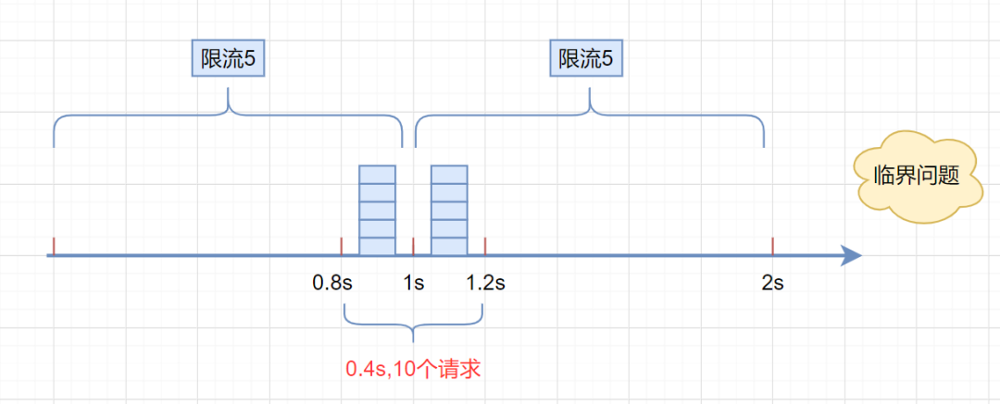
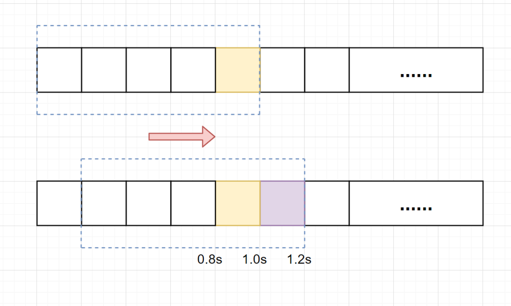
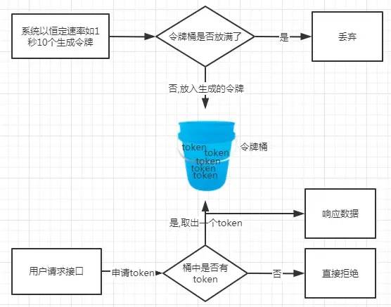
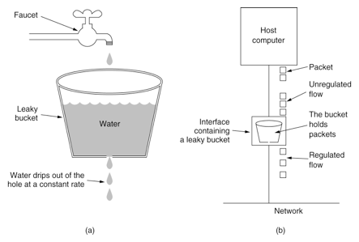

## 一、限流的基本概念
在当今高速发展的互联网应用领域，面对高并发和海量流量的挑战，限流（Rate Limiting）技术显得尤为重要。它不仅能够有效防护系统免受突发流量的冲击，确保系统的稳定运行，同时也能保证资源得到公正合理的分配，从而提升用户体验。 限流，即是控制流量。具体到计算机系统中，它通常指对特定服务或资源在单位时间内所能接受的请求次数进行限制。以下是几种常见的限流算法：

+ 固定窗口算法又叫计数器算法（Fixed Window）：在固定时间窗口(单位时间)内限制请求的数量。
+ 滑动窗口算法（Sliding Window）：将单位时间周期分为n个小周期，分别记录每个小周期内接口的访问次数，并且根据时间滑动删除过期的小周期。
+ `令牌桶算法`（Token Bucket）：维护一个固定容量的令牌桶，按照固定速率往桶中添加令牌，每当有请求到来时，消耗一个令牌，如果桶中没有足够的令牌，则拒绝该请求。
+ `漏桶算法`（Leaky Bucket）：类似于一个漏桶，数据流(水)以固定的速率流出，如果流入的速率超过了漏桶的容量，多余的数据将被丢弃或延迟处理。

## 二、限流算法

### 2.1 固定窗口算法（Fixed Window）
固定窗口限流算法（Fixed Window Rate Limiting Algorithm）是一种最简单的限流算法，其原理是在固定时间窗口(单位时间)内限制请求的数量。该算法将时间分成固定的窗口，并在每个窗口内限制请求的数量。具体来说，算法将请求按照时间顺序放入时间窗口中，并计算该时间窗口内的请求数量，如果请求数量超出了限制，则拒绝该请求。

+ 时间窗口划分：首先定义一个固定的时间窗口（例如每秒、每分钟等），在此期间内的所有请求都会被计数。
+ 计数器累加：每当有一个请求到来时，计数器就会增加一次。这个计数器记录了在当前时间窗口内接收到的请求数量。
+ 阈值判断：如果计数器的值小于或等于设定的阈值，则允许请求通过；如果计数值超过了阈值，则拒绝后续的请求。
+ 重置计数器：当时间窗口结束时，计数器会被重置为零，以便开始下一个周期的计数。



+ 优点：简单易实现，对于固定流量场景适用。
+ 缺点：无法处理突发流量，可能导致性能下降或服务不可用。<br>
存在 明显的临界问题，比如: 假设限流阀值为 5个请求，单位时间窗口是 1s,如果我们在单位时间内的 前0.8-1s和 1-1.2s，分别并发5个请求。虽然都没有超过阀值，但是如果算0.8-1.2s,则并发数高达10， 已经超过单位时间1s不超过5阀值的定义啦。

```python
import time
from threading import Lock


class FixedWindow(object):

    def __init__(self, capacity: int, time_window: int = 1):
        """
        :param capacity:  请求数阈值
        :param time_window: 固定的时间窗口（例如每秒、每分钟等），在此期间内的所有请求都会被计数，这里单位是秒
        """
        self._capacity = capacity
        self._time_window = time_window
        self._req_count = 0
        self._last_time = time.time()
        self._lock = Lock()

    def _reset(self):
        """
        重置计数器
        """
        now = time.time()
        elapsed = int(now - self._last_time)  # 秒
        if elapsed >= self._time_window:
            self._req_count = 0
            self._last_time = now

    def consume(self, req: int = 1) -> bool:
        """
        :return 是否请求成功
        """
        self._lock.acquire()   # 加锁
        try:
            self._reset()
            if self._req_count + req <= self._capacity:
                self._req_count += req
                return True
            return False
        finally:
            self._lock.release()   # 确保锁释放
```

### 2.2 滑动窗口算法（Sliding Window）

滑动窗口限流算法是一种常用的限流算法，用于控制系统对外提供服务的速率，防止系统被过多的请求压垮。
它将单位时间周期分为n个小周期，分别记录每个小周期内接口的访问次数，并且根据时间滑动删除过期的小周期。它可以解决固定窗口临界值的问题。



+ 解决固定窗口限流算法的临界问题<br>
假设1s内的限流阀值还是5个请求，0.8~1.0s内（比如0.9s的时候）来了5个请求，落在黄色格子里。时间过了1.0s这个点之后，又来5个请求，落在紫色格子里。如果是固定窗口算法，是不会被限流的，但是滑动窗口的话，每过一个小周期，它会右移一个小格。过了1.0s这个点后，会右移一小格，当前的单位时间段是0.2~1.2s，这个区域的请求已经超过限定的5了，已触发限流，实际上，紫色格子的请求都被拒绝。

+ 优点： 简单易懂、 精度高（通过调整时间窗口的大小来实现不同的限流效果）、可扩展性强（可以非常容易地与其他限流算法结合使用）
+ 缺点： 突发流量无法处理，需要合理调整时间窗口大小。

```python
import time
from collections import OrderedDict
from threading import Lock


class SlidingWindow(object):
    """
    滑动窗口时间算法
    """

    def __init__(self, capacity: int, window_size: int = 30, cycle_size: int = 3):
        """
        :param capacity:  请求数阈值
        :param window_size: 时间窗口30秒
        :param cycle_size:  小周期时间（将时间窗口划分为N个小周期） eg.时间窗口30秒，3秒一个周期，一共10个周期
        """
        self._capacity = capacity
        self._window_size = window_size
        self._cycle_count = int(window_size / cycle_size)
        self._cycle_size = cycle_size  # 3秒一个周期

        self._counter = OrderedDict()
        self._req_count = 0
        self._lock = Lock()

    def print_counter(self):
        """
        打印窗口内的所有周期和请求数
        """
        for i, (k, v) in enumerate(self._counter.items(), start=1):
            print(f"周期{i}=[{k}, {k + self._cycle_size}), 请求数={v}")

    def _count_req_in_window(self, cur_cycle_start_time: int):
        """
        统计当前窗口的请求数（遍历所有小周期）
        """
        # 计算窗口开始时间
        cur_window_start_time = cur_cycle_start_time - self._cycle_size * (self._cycle_count - 1)
        count = 0
        for key, value in list(self._counter.items()):
            # 删除无效过期的子窗口计数器
            if key < cur_window_start_time:
                self._counter.pop(key)
            else:
                count += value
        return count

    def consume(self, req: int = 1) -> bool:
        """
        :return 是否请求成功
        """
        self._lock.acquire()   # 加锁
        try:
            # 计算当前小周期开始时间：当前(1744200124), 开始时间=1744200123=int(1744200124/3)*3，即第10个周期是 [1744200123, 1744200126]
            cur_cycle_start_time = int(time.time() / self._cycle_size) * self._cycle_size
            req_count = self._count_req_in_window(cur_cycle_start_time)

            if req_count + req <= self._capacity:
                # 更新计数器
                self._counter[cur_cycle_start_time] = self._counter.get(cur_cycle_start_time, 0) + req
                return True
            return False
        finally:
            self._lock.release()   # 确保锁释放
```

### 2.3 令牌桶算法（Token Bucket）
令牌桶算法是一种基于令牌的限流算法，它维护一个固定容量的令牌桶，按照固定速率往桶中添加令牌，每当有请求到来时，消耗一个令牌，如果桶中没有足够的令牌，则拒绝该请求。



+ 优点：平滑限流，可以应对突发流量（峰值流量=桶容量+填充速率）；灵活控制流量速率。
+ 缺点：对于突发流量，需要足够的令牌桶容量用来应对，否则可能会出现丢弃部分请求的情况。

令牌桶算法的基本原理和工作流程：
1. 令桶牌：类似于一个存放令牌的容器，假设桶中最多可以存放b个令牌。
2. 令牌生成：假设令牌平均生产速率r，则每隔1/r秒一个令牌被加入到桶中，直到达到桶容量上限。如果令牌到达时令牌桶已经满了，那么这个令牌会被丢弃。
3. 处理请求：每次尝试获取一个或多个令牌，如果拿到则处理请求，失败则拒绝请求（限流逻辑）。

```python
import time
from threading import Lock


class TokenBucket(object):
    """
    令牌桶算法（单机版）
    """
    def __init__(self, capacity: int, fill_rate: int):
        """
        :param capacity:  The total tokens in the bucket.
        :param fill_rate:  The rate in tokens/second that the bucket will be refilled
        """
        self._capacity = int(capacity)
        self._tokens = int(capacity)
        self._fill_rate = int(fill_rate)
        self._last_time = time.time()
        self._lock = Lock()

    def _refill(self) -> int:
        """补充令牌"""
        now = time.time()
        elapsed = int(now - self._last_time)
        if elapsed > 0 and self._tokens < self._capacity:
            now = time.time()
            delta = int(self._fill_rate * elapsed)
            self._tokens = min(self._capacity, self._tokens + delta)
            self._last_time = now
        return self._tokens

    def consume(self, tokens: int = 1) -> bool:
        """
        获取令牌
        :param tokens: 需要的令牌数量
        :return: 是否获取成功
        """
        self._lock.acquire()   # 加锁
        try:
            self._refill()
            if tokens <= self._tokens:
                self._tokens -= tokens
                return True
            return False
        finally:
            self._lock.release()   # 确保锁释放
```

### 2.4 漏桶算法（Leaky Bucket）

漏桶算法（Leaky Bucket）将 `服务的请求量限额` 比喻为一个一直装满水的桶，每隔固定时间向外漏 N 滴水。如果请求方接到了这滴水，就可以继续请求服务，如果没有接到，就需要等待下一滴水。 也就是说，不管请求量有多少，单位时间内请求额度 (漏水流出的容量) 是固定的。

主要特点包括：
+ `固定的处理速率`：漏桶以固定的速率处理请求，无论流入的速率是多少，都会以固定的速率流出。
+ `漏桶容量有限`：漏桶有一个固定的容量，超过容量的请求将被丢弃或延迟处理。



+ 应用场景：包括网络流量控制、接口限流、短信发送限制等。
+ 优点：平滑限流，限制请求的处理速率，防止突发请求对系统造成过大的压力。
+ 缺点：对于突发流量，可能会出现短时的请求丢失。

```python
import time
from threading import Lock


class LeakyBucket(object):
    """
    漏桶算法
    """
    def __init__(self, capacity: int, leak_rate: int):
        """
        :param capacity:  漏桶的容量
        :param leak_rate: 固定的处理速率
        """
        self._capacity = int(capacity)
        self._leak_rate = int(leak_rate)
        self._water = 0  # 初始化时漏桶内的水（请求）为0
        self._last_time = time.time()
        self._lock = Lock()

    def _leak(self) -> int:
        """
        漏水
        """
        now = time.time()
        elapsed = int(now - self._last_time)
        if elapsed >= 1:
            self._water = max(0, self._water - int(self._leak_rate * elapsed))  # 水随着时间流逝，不断流走，最多就流干到0.
            self._last_time = now
        return self._water

    def consume(self, water: int = 1) -> bool:
        """
        获取水滴
        :param water: 需要的水滴数量
        :return: 是否获取成功
        """
        self._lock.acquire()   # 加锁
        try:
            self._leak()
            if self._water + water <= self._capacity:
                self._water += water
                return True
            return False
        finally:
            self._lock.release()   # 确保锁释放
```

## 三、分布式限流：基于 Redis 实现


## 参考引用
[1] [面试必备：四种经典限流算法讲解](https://heapdump.cn/article/5480577)<br>
[2] [5种限流算法，7种限流方式，挡住突发流量？](https://www.cnblogs.com/niumoo/p/16007224.html)<br>
[3] [深入探索令牌桶限流的原理与实践](https://www.cnblogs.com/DTinsight/p/18221858)<br>
[4] [Rate Limiter](https://github.com/titan-web/rate-limit)<br>
[5] [漏桶算法和令牌桶算法](https://dbwu.tech/posts/golang_ratelimit/)<br>
[6] [Rate Limiter Leaky Bucket算法](https://github.com/springside/springside4/wiki/Rate-Limiter)<br>
[7] [分布式限流：基于 Redis 实现](https://pandaychen.github.io/2020/09/21/A-DISTRIBUTE-GOREDIS-RATELIMITER-ANALYSIS/)<br>
[8] [Python实现高效并发限流：Ratelimiter原理与实战解析](https://www.oryoy.com/news/python-shi-xian-gao-xiao-bing-fa-xian-liu-ratelimiter-yuan-li-yu-shi-zhan-jie-xi.html)<br>
